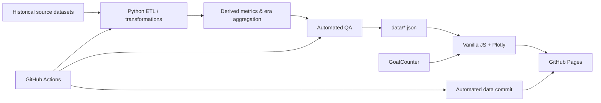

<div align="center">


# NBA Analytics | by TAP

### Historical & Modern NBA Statistical Intelligence — 1988 → Today

**Dashboard interativo para análise histórica da NBA, comparação entre eras, rankings de jogadores e equipes, shooting zones, faltas/PBP e análise de matchups entre gerações.**

O projeto foi construído com foco em **integridade estatística, rastreabilidade, automação, qualidade de dados e visualização executiva**.

[**🌐 Live Dashboard**](https://thalesandradepereira.github.io/nba-analytics/) · [**⚙️ GitHub Actions**](https://github.com/thalesandradepereira/nba-analytics/actions) · [**✅ QA Report**](data/qa_report.json) · [**🕒 Data Metadata**](data/meta.json)

[](https://github.com/thalesandradepereira/nba-analytics/actions/workflows/update-nba-data.yml)

</div>

---

## 1. Executive Overview

**NBA Analytics** é uma aplicação web independente voltada à análise quantitativa da NBA entre **1988-89 e a temporada mais recente disponível na fonte de dados**.

O projeto combina engenharia de dados, estatística aplicada e visualização interativa para responder perguntas como:

- Como o estilo de jogo da NBA evoluiu ao longo das décadas?
- Quais jogadores lideram diferentes métricas dentro de cada período?
- Como volume, eficiência, faltas, spacing, arremessos de 3 e jogo interior mudaram ao longo do tempo?
- Quais equipes tiveram os melhores picos estatísticos?
- Como diferentes gerações se comparariam em um confronto hipotético sob regras atuais?

A aplicação é publicada por **GitHub Pages**, utiliza **Plotly.js** para visualização e possui um pipeline automatizado em **Python + GitHub Actions** para atualização, validação e republicação dos dados.

### Princípios de engenharia do projeto

1. **No fabricated data** — valores ausentes permanecem ausentes; não há preenchimento arbitrário.
2. **Traceability by design** — fonte, cobertura, transformações e métricas derivadas são documentadas.
3. **Era-aware analytics** — diferenças de cobertura histórica são tratadas explicitamente.
4. **Reproducibility** — métricas derivadas são calculadas por regras determinísticas.
5. **Automated QA** — o pipeline valida filtros, métricas, ranges e combinações de período antes da publicação.
6. **Progressive enhancement** — falhas em analytics externos ou campos sem cobertura não impedem o funcionamento do dashboard.

---

## 2. Current Production Status

| Item | Status atual |
|---|---|
| **Publicação** | GitHub Pages |
| **URL** | https://thalesandradepereira.github.io/nba-analytics/ |
| **Snapshot de dados** | 2025-26 |
| **Série histórica** | 1988-89 → 2025-26 |
| **Último rebuild registrado** | 11/08/2026 UTC |
| **QA programático** | PASS |
| **Checks automáticos** | 441 |
| **Combinações de período testadas** | 7 |
| **Erros críticos no último QA** | 0 |
| **Interface** | PT-BR / EN-US |
| **Analytics de acesso** | GoatCounter |

A referência operacional para a temporada e timestamp efetivamente publicados é [`data/meta.json`](data/meta.json). O resultado detalhado da validação está em [`data/qa_report.json`](data/qa_report.json).

---

## 3. Analytical Scope

### Períodos principais

O histórico é organizado em três blocos não sobrepostos:

- **1988-89 → 1999-00**
- **2000-01 → 2009-10**
- **2010-11 → temporada corrente disponível**

### Multi-period analysis

O filtro global permite selecionar:

- uma era;
- qualquer combinação de duas eras;
- todos os períodos simultaneamente.

Isso resulta em **7 combinações válidas de seleção**.

Quando mais de uma era é escolhida:

- séries temporais permanecem visualmente separadas por era;
- métricas acumulativas de jogadores são consolidadas entre os períodos;
- médias por jogo são recalculadas a partir dos totais quando possível;
- percentuais são derivados dos respectivos numeradores e denominadores quando disponíveis;
- PER e BPM consolidados usam ponderação por minutos;
- Corner 3% consolidado usa ponderação pelo volume estimado de tentativas de Corner 3;
- rankings de equipes consideram todas as temporadas pertencentes às eras selecionadas.

A seleção é persistida no navegador via `localStorage`.

---

## 4. Dashboard Modules

| Módulo | Objetivo |
|---|---|
| **Visão Geral** | KPIs da liga, evolução temporada a temporada e comparação entre eras |
| **Top 30 Jogadores** | Rankings por métricas tradicionais, avançadas, shooting, faltas e PBP |
| **Explorador de Jogador** | Perfil consolidado por período, com estatísticas tradicionais e avançadas |
| **Arremessos & Zonas** | Distribuição por distância, Corner 3, participação dos 3P, dunks e líderes |
| **Faltas & PBP** | PF, FTA, shooting fouls, offensive fouls, And-1 e eventos de contato |
| **Equipes** | Melhores temporadas por Win%, W, SRS, Net Rating, ORtg, DRtg, Pace e outras métricas |
| **Best Team Forever** | Inferência de matchup entre seleções representativas das três eras |
| **Metodologia & Fontes** | Regras de integridade, cobertura e origem dos dados |
| **Acrônimos & Legendas** | Glossário técnico com significado, interpretação, fórmula e categoria das métricas |

### Interface

- alternância instantânea entre **Português (Brasil)** e **English (United States)**;
- layout responsivo;
- filtros persistentes;
- gráficos Plotly com escalas controladas;
- fallback explícito para `N/D` / `N/A` quando não existe cobertura;
- contador público de visitas integrado ao GoatCounter.

---

## 5. Statistical Coverage

### Player metrics

**Traditional / counting**

`G`, `GS`, `MP`, `PTS`, `FG`, `FGA`, `3PM`, `3PA`, `FTM`, `FTA`, `ORB`, `DRB`, `TRB`, `AST`, `STL`, `BLK`, `TOV`, `PF`.

**Per-game / efficiency**

`PPG`, `RPG`, `APG`, `BPG`, `FG%`, `3P%`, `FT%`, `eFG%`, `TS%`.

**Advanced**

`PER`, `USG%`, `OWS`, `DWS`, `WS`, `WS/48`, `OBPM`, `DBPM`, `BPM`, `VORP`.

**Shooting / location**

- 0–3 ft;
- 3–10 ft;
- 10–16 ft;
- 16 ft–3P;
- 3P share / `3PAr`;
- Corner 3;
- dunks.

**Play-by-Play / events**

- shooting fouls committed/drawn;
- offensive fouls committed/drawn;
- And-1;
- bad-pass turnovers;
- lost-ball turnovers;
- blocked FGA;
- points generated by assists;
- triple-doubles, quando disponíveis na base.

### Team metrics

Entre as métricas de equipes utilizadas no dashboard estão:

`W`, `L`, `Win%`, `SRS`, `ORtg`, `DRtg`, `Net Rating`, `Pace`, `PTS/G`, `3PA/G`, `BLK/G` e demais estatísticas processadas pelo pipeline.

---

## 6. Statistical Integrity & Derived Metrics

A regra de integridade central do projeto é:

> **Missing values remain null; no arbitrary imputation.**

Na interface:

- `N/D` = não disponível;
- `N/A` = not available.

Ausência de informação não é interpretada como zero.

### Exemplos de métricas derivadas

```text
PPG   = PTS / G
RPG   = TRB / G
APG   = AST / G
BPG   = BLK / G
3P%   = 3PM / 3PA
FT%   = FTM / FTA
WS/48 = WS × 48 / MP
TS%   = PTS / [2 × (FGA + 0.44 × FTA)]
```

### Aggregation policy

Para análises cross-era:

- contagens são somadas;
- médias por jogo são recalculadas a partir dos totais;
- PER/BPM são ponderados por minutos;
- percentuais dependentes de tentativas são ponderados pelos respectivos volumes;
- jogadores trocados são tratados utilizando linhas agregadas (`2TM`, `3TM`, etc.) quando disponíveis, evitando dupla contagem.

### Shot-location estimates

Quando uma quantidade absoluta não é fornecida diretamente, algumas tentativas por zona são derivadas de forma transparente por:

```text
published share × exact attempts
```

Esses valores são tratados como **métricas derivadas**, não como contagens oficiais publicadas.

---

## 7. Historical Coverage & Known Limitations

Nem todas as estatísticas possuem cobertura homogênea desde 1988.

### Shot location / dunks / Corner 3 / PBP

A cobertura detalhada utilizada no projeto começa, em geral, em **1996-97**. Por isso:

- a primeira era possui cobertura parcial para essas famílias;
- temporadas sem dado permanecem `null`;
- o dashboard não extrapola informação para períodos anteriores.

### Three-point line context

A NBA utilizou uma linha de três temporariamente encurtada entre **1994-95 e 1996-97**. Essa mudança de regra é relevante para qualquer comparação histórica de volume ou eficiência de 3 pontos.

### 1990s shot-location quality

Dados de localização e tipo de arremesso da década de 1990 possuem menor consistência do que os registros modernos. O projeto mantém essa limitação explícita em vez de mascará-la por interpolação.

---

## 8. Best Team Forever

A aba **Best Team Forever** compara seleções representativas das três eras em um confronto hipotético sob regras atuais.

A análise considera, entre outros fatores:

- pico estatístico individual;
- eficiência absoluta e relativa à liga;
- criação ofensiva;
- spacing e volume de três;
- defesa interior e perímetro;
- switchability;
- complementaridade de funções;
- adaptação ao ambiente tático moderno.

> **Importante:** o resultado é uma inferência analítica de matchup. Não é um resultado observado, uma previsão probabilística certificada ou uma afirmação determinística sobre um jogo que nunca ocorreu.

---

## 9. Data Architecture



### Front-end stack

- HTML5
- CSS3
- Vanilla JavaScript
- Plotly.js
- `localStorage`
- GitHub Pages

Não há build obrigatório com Node.js.

### Data engineering stack

- Python 3.12
- pandas
- NumPy
- requests
- JSON como contrato entre pipeline e front-end
- GitHub Actions para execução automatizada

As dependências Python estão em [`requirements.txt`](requirements.txt).

---

## 10. Data Pipeline

O processo principal está em [`scripts/update_data.py`](scripts/update_data.py).

### Automated source

A fonte automatizada atual é:

[`sumitrodatta/bball-reference-datasets`](https://github.com/sumitrodatta/bball-reference-datasets)

O conjunto é estruturado a partir de dados do Basketball-Reference.

### High-level flow

1. download das tabelas necessárias;
2. seleção e normalização dos registros NBA;
3. padronização das temporadas desde 1988-89;
4. tratamento de jogadores que atuaram por múltiplas equipes;
5. integração de dados tradicionais, advanced, shooting e PBP;
6. cálculo das métricas derivadas reproduzíveis;
7. agregação jogador × era;
8. construção equipe × temporada;
9. construção das séries da liga;
10. geração dos JSONs publicados;
11. atualização dos metadados;
12. execução da matriz de QA;
13. commit automático somente quando há alteração válida.

---

## 11. Generated Data Contracts

| Arquivo | Responsabilidade |
|---|---|
| [`data/players.json`](data/players.json) | Agregados de jogadores por era |
| [`data/teams.json`](data/teams.json) | Estatísticas de equipes por temporada |
| [`data/league.json`](data/league.json) | Série histórica da liga |
| [`data/era_summary.json`](data/era_summary.json) | Resumo consolidado por período |
| [`data/meta.json`](data/meta.json) | Timestamp, temporada corrente, fonte e regra de integridade |
| [`data/qa_report.json`](data/qa_report.json) | Resultado da validação automática |

O front-end trata esses arquivos como contratos de dados publicados. Mudanças de schema devem ser coordenadas com a lógica de renderização e com os testes de validação.

---

## 12. Quality Assurance

### Data QA

A validação programática é executada por:

[`scripts/validate_dashboard.py`](scripts/validate_dashboard.py)

O snapshot atualmente publicado registra:

```text
Status: PASS
Checks: 441
Selection combinations: 7
Critical errors: 0
```

A matriz cobre:

- todas as combinações válidas de períodos;
- métricas de liga;
- rankings de jogadores;
- rankings de equipes;
- shooting/zones;
- faltas;
- PBP;
- ranges válidos para percentuais e métricas críticas;
- ausência histórica esperada.

Indisponibilidades legítimas são registradas como **warnings**, não como valores fabricados.

### UI QA

O projeto também possui uma camada de proteção de interface em [`dashboard-qa-v2.js`](dashboard-qa-v2.js), responsável por:

- remover placeholders `N/D` residuais antes de um redraw válido;
- garantir que filtros chamem os renderizadores mais recentes após overrides de multi-período;
- evitar estados em que tabela válida e mensagem de indisponibilidade apareçam simultaneamente;
- fornecer um glossário técnico expandido;
- preservar comportamento consistente após mudanças de idioma, período e métrica.

> O QA programático reduz regressões de dados e lógica. Testes visuais em navegadores/resoluções diferentes continuam recomendados para mudanças relevantes de UI.

---

## 13. Glossary & Metric Documentation

A aba **Acrônimos & Legendas** funciona como documentação estatística integrada ao produto.

Ela cobre métricas tradicionais, avançadas, de equipes, shooting e PBP e apresenta, quando aplicável:

- sigla;
- nome completo em inglês;
- significado e interpretação;
- fórmula ou regra de leitura;
- categoria;
- observações sobre cobertura histórica.

Exemplos incluem `PPG`, `RPG`, `APG`, `3P%`, `3PAr`, `TS%`, `eFG%`, `PER`, `WS`, `WS/48`, `BPM`, `OBPM`, `DBPM`, `VORP`, `ORtg`, `DRtg`, `Net Rating`, `SRS`, `Corner 3%`, `Shooting fouls drawn`, `Offensive fouls drawn` e `And-1`.

---

## 14. Automation & Deployment

O workflow está em:

[`.github/workflows/update-nba-data.yml`](.github/workflows/update-nba-data.yml)

### Scheduled refresh

```cron
17 12 11 2,8 *
```

Execução programada em:

- **11 de fevereiro**;
- **11 de agosto**;
- às **12:17 UTC**.

Também pode ser executado manualmente em:

**Actions → Refresh NBA Analytics data → Run workflow**

### Workflow sequence

```text
Checkout repository
      ↓
Python 3.12
      ↓
Install dependencies
      ↓
Download / rebuild data
      ↓
Validate dashboard dataset
      ↓
Commit refreshed data if changed
      ↓
GitHub Pages deploy
```

Se a validação detectar erro crítico, o fluxo deve falhar antes da publicação do novo snapshot.

---

## 15. Access Analytics

O dashboard utiliza **GoatCounter** para registrar e exibir o total público de visitas.

Arquivos relacionados:

- [`analytics-config.js`](analytics-config.js)
- [`analytics.js`](analytics.js)
- [`analytics.css`](analytics.css)
- [`ANALYTICS_SETUP.md`](ANALYTICS_SETUP.md)

### Design principles

- nenhuma API key ou token privado é armazenado no JavaScript público;
- falha ou bloqueio do tracker não impede o carregamento do dashboard;
- o contador público é carregado independentemente dos dados estatísticos da NBA;
- analytics é tratado como funcionalidade auxiliar, não como dependência crítica.

O valor exibido no site pode apresentar atraso em relação ao painel administrativo do provedor devido a cache do contador público.

---

## 16. Repository Structure

```text
nba-analytics/
├── index.html
├── styles.css
├── app.js
│
├── shooting-v2.css
├── shooting-v2.js
├── period-multiselect.css
├── period-multiselect.js
├── dashboard-qa-v2.js
│
├── analytics-config.js
├── analytics.js
├── analytics.css
├── ANALYTICS_SETUP.md
│
├── assets/
│   └── tap-logo.jpg
│
├── data/
│   ├── players.json
│   ├── teams.json
│   ├── league.json
│   ├── era_summary.json
│   ├── meta.json
│   └── qa_report.json
│
├── scripts/
│   ├── update_data.py
│   └── validate_dashboard.py
│
├── .github/
│   └── workflows/
│       └── update-nba-data.yml
│
├── requirements.txt
├── .nojekyll
└── README.md
```

---

## 17. Run Locally

### Clone

```bash
git clone https://github.com/thalesandradepereira/nba-analytics.git
cd nba-analytics
```

### Create Python environment

macOS / Linux:

```bash
python3 -m venv .venv
source .venv/bin/activate
```

Windows PowerShell:

```powershell
py -m venv .venv
.\.venv\Scripts\Activate.ps1
```

### Install dependencies

```bash
pip install -r requirements.txt
```

### Rebuild data

```bash
python scripts/update_data.py
```

> Esta etapa requer conexão com a internet.

### Run QA

```bash
python scripts/validate_dashboard.py
```

A publicação de um novo snapshot deve ocorrer somente após `PASS`.

### Serve locally

Na raiz do repositório:

```bash
python3 -m http.server 8000
```

Abra:

```text
http://localhost:8000
```

Evite abrir `index.html` diretamente por `file://`, pois o navegador pode bloquear o carregamento dos arquivos JSON locais.

---

## 18. Maintenance Checklist

Antes de uma alteração relevante em produção:

- [ ] confirmar que `data/meta.json` aponta para a temporada esperada;
- [ ] executar `scripts/validate_dashboard.py`;
- [ ] verificar `data/qa_report.json` e confirmar `PASS`;
- [ ] testar os 3 períodos individualmente;
- [ ] testar seleção de 2 períodos;
- [ ] testar todos os períodos;
- [ ] validar filtros de jogadores e equipes;
- [ ] validar métricas com cobertura parcial (`Corner 3`, dunks, PBP);
- [ ] alternar PT-BR ↔ EN-US;
- [ ] verificar desktop e viewport móvel;
- [ ] confirmar que o contador de visitas não interfere no carregamento do dashboard;
- [ ] aguardar GitHub Pages concluir o deploy.

---

## 19. Security & Privacy

Este é um site estático. O repositório não deve conter:

- senhas;
- tokens GitHub;
- API keys privadas;
- cookies de autenticação;
- credenciais do provedor de analytics.

Identificadores públicos necessários ao funcionamento client-side podem permanecer no repositório, desde que não concedam acesso administrativo.

---

## 20. Attribution & Disclaimer

Este é um **projeto independente de análise estatística**.

- Não é um produto oficial da NBA.
- Não representa ou substitui Basketball-Reference ou qualquer outro provedor de dados.
- Marcas, nomes de equipes e jogadores pertencem aos respectivos titulares.
- As análises derivadas e inferências de matchup refletem a metodologia documentada neste projeto.

A fonte automatizada atualmente utilizada é [`sumitrodatta/bball-reference-datasets`](https://github.com/sumitrodatta/bball-reference-datasets), estruturada a partir de dados do Basketball-Reference.

---

<div align="center">

### Made by TAP

**NBA Analytics — Historical Performance Intelligence**

Engineering · Statistics · Data Visualization · Automation

</div>
