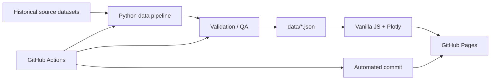

<div align="center">


# NBA Analytics | by TAP

**Historical & Modern NBA Statistical Intelligence — 1988 → Today**

Dashboard interativo para análise histórica da NBA, comparação entre eras, rankings de jogadores e equipes, arremessos por zona, faltas/PBP e estudo de matchup entre gerações — com foco em **rastreabilidade estatística, ausência de valores inventados e atualização automatizada**.

[**🌐 Abrir Dashboard**](https://thalesandradepereira.github.io/nba-analytics/) · [**⚙️ GitHub Actions**](https://github.com/thalesandradepereira/nba-analytics/actions) · [**📊 QA Report**](data/qa_report.json) · [**🕒 Data Metadata**](data/meta.json)

[](https://github.com/thalesandradepereira/nba-analytics/actions/workflows/update-nba-data.yml)

</div>

---

## Visão geral

O **NBA Analytics** é um projeto independente de análise estatística que consolida dados históricos e modernos da NBA em uma aplicação web estática hospedada pelo **GitHub Pages**.

O projeto foi desenhado com quatro princípios:

1. **Integridade estatística** — nenhuma lacuna histórica é preenchida com valor arbitrário.
2. **Comparabilidade entre eras** — os recortes são explícitos e podem ser combinados sem esconder diferenças de cobertura.
3. **Rastreabilidade** — dados de fonte, métricas derivadas, cobertura e limitações são documentados.
4. **Automação** — o pipeline baixa, processa, valida e republica os dados automaticamente.

A interface é bilíngue, com alternância instantânea entre **Português (Brasil)** e **English (United States)**.

---

## Principais recursos

| Área | O que o dashboard oferece |
|---|---|
| **Visão Geral** | KPIs por período, evolução temporada a temporada e comparação entre eras |
| **Top 30 Jogadores** | Rankings por VORP, WS, pontos, rebotes, assistências, 3P, FT, TS%, PER, BPM, dunks, faltas e outras métricas |
| **Explorador de Jogador** | Perfil consolidado do atleta, com estatísticas tradicionais, avançadas e de shooting/PBP quando disponíveis |
| **Arremessos & Zonas** | Distribuição por distância, Corner 3, volume de enterradas e líderes em dunks |
| **Faltas & PBP** | PF, FTA, shooting fouls, offensive fouls, And-1 e categorias de contato |
| **Equipes** | Ranking de temporadas por vitórias, Win%, SRS, Net Rating, ORtg, DRtg, Pace e outras métricas |
| **Best Team Forever** | Estudo comparativo entre seleções históricas das três eras sob regras atuais |
| **Acrônimos & Legendas** | Glossário das métricas e siglas utilizadas |
| **PT-BR / EN-US** | Interface bilíngue com preferência salva no navegador |
| **Multi-período** | Seleção de uma, duas ou todas as eras, com agregação cross-era |

---

## Períodos analíticos

O dashboard organiza a série histórica em três blocos não sobrepostos:

- **1988-89 a 1999-00**
- **2000-01 a 2009-10**
- **2010-11 até a temporada mais recente disponível na fonte**

### Filtro multi-período

O seletor global permite escolher:

- uma era;
- qualquer combinação de duas eras;
- **todos os períodos**.

Isso gera **7 combinações possíveis de seleção**.

Quando mais de uma era é selecionada:

- séries temporais permanecem separadas por período, evitando linhas artificiais entre intervalos não contíguos;
- estatísticas acumulativas de um mesmo jogador são somadas entre os períodos selecionados;
- médias por jogo e percentuais são recalculados a partir dos totais quando possível;
- PER e BPM consolidados usam ponderação por minutos;
- Corner 3% consolidado usa ponderação pelo volume estimado de tentativas de Corner 3;
- rankings de equipes consideram todas as temporadas pertencentes às eras selecionadas.

A seleção é persistida em `localStorage` e restaurada ao retornar ao dashboard.

---

## Cobertura estatística

### Jogadores

O pipeline trabalha, entre outras, com as seguintes famílias de métricas:

**Tradicionais**

`G`, `GS`, `MP`, `PTS`, `FG`, `FGA`, `3P`, `3PA`, `FT`, `FTA`, `ORB`, `DRB`, `TRB`, `AST`, `STL`, `BLK`, `TOV`, `PF`.

**Eficiência e avançadas**

`FG%`, `3P%`, `FT%`, `eFG%`, `TS%`, `PER`, `USG%`, `OBPM`, `DBPM`, `BPM`, `VORP`, `WS`, `WS/48`.

**Shooting / zonas**

- distância média do arremesso;
- 0–3 ft;
- 3–10 ft;
- 10–16 ft;
- 16 ft–3P;
- participação dos arremessos de 3;
- Corner 3;
- dunks.

**Play-by-Play / eventos**

- shooting fouls committed/drawn;
- offensive fouls committed/drawn;
- And-1;
- bad-pass turnovers;
- lost-ball turnovers;
- FGA blocked;
- pontos gerados por assistências.

### Equipes

Entre as métricas disponíveis estão:

`W`, `L`, `Win%`, `SRS`, `ORtg`, `DRtg`, `Net Rating`, `Pace`, `PTS/G`, `3PA/G`, `BLK/G` e demais totais/per-game processados pelo pipeline.

---

## Integridade estatística

Este projeto adota explicitamente a regra:

> **Missing values remain null; no arbitrary imputation.**

Na interface:

- `N/D` = não disponível em Português;
- `N/A` = not available em Inglês.

### Dados de fonte × métricas derivadas

O dashboard diferencia conceitualmente:

- **dados publicados pela fonte**, como totais tradicionais, VORP, WS, PER/BPM, dunks e eventos PBP;
- **métricas derivadas**, calculadas de forma reproduzível a partir desses dados.

Exemplos de cálculos derivados:

```text
PPG = PTS / G
RPG = TRB / G
APG = AST / G
3P% = 3P / 3PA
FT% = FT / FTA
WS/48 = WS × 48 / MP
TS% = PTS / [2 × (FGA + 0,44 × FTA)]
```

Para algumas análises de localização de arremesso, quantidades de tentativas por zona são estimadas de forma transparente a partir de **share publicado × tentativas exatas**. Essas estimativas não são apresentadas como contagens oficiais exatas.

---

## Limitações históricas importantes

Nem todas as estatísticas existem com a mesma cobertura desde 1988.

- **Shot location**, dunks, Corner 3 e várias categorias de **Play-by-Play** ficam disponíveis principalmente a partir de **1996-97** na fonte utilizada.
- A linha de 3 pontos da NBA foi temporariamente encurtada entre **1994-95 e 1996-97**, criando uma quebra histórica relevante para análises de volume e eficiência de 3 pontos.
- Dados históricos de localização/tipo de arremesso dos anos 1990 possuem menor consistência do que as temporadas modernas.
- O dashboard não extrapola esses campos para temporadas em que a fonte não os publica.

Essas limitações são tratadas como parte do modelo de dados, não como erro a ser preenchido artificialmente.

---

## Best Team Forever

A aba **Best Team Forever** compara três seleções de era em um confronto hipotético sob regras atuais.

A análise combina:

- pico estatístico individual dentro da era;
- eficiência relativa;
- criação ofensiva;
- spacing;
- defesa interior e no perímetro;
- switchability;
- complementaridade de funções;
- adaptação ao ambiente tático atual.

> O resultado dessa aba é uma **inferência analítica de matchup**. Não é uma estatística observada, uma simulação probabilística certificada ou uma afirmação de que determinado resultado teria necessariamente ocorrido.

---

## Arquitetura



### Front-end

- HTML5
- CSS3 responsivo
- Vanilla JavaScript
- Plotly.js
- `localStorage` para idioma e seleção de períodos
- GitHub Pages

Não há etapa obrigatória de build com Node.js.

### Data engineering / automation

- Python 3.12 no GitHub Actions
- pandas
- NumPy
- requests
- JSON como camada de dados consumida pelo front-end

As dependências Python estão declaradas em [`requirements.txt`](requirements.txt).

---

## Pipeline de dados

O pipeline principal está em [`scripts/update_data.py`](scripts/update_data.py).

A fonte automatizada atual é o repositório:

- [`sumitrodatta/bball-reference-datasets`](https://github.com/sumitrodatta/bball-reference-datasets), estruturado a partir de dados do Basketball-Reference.

O processo executa, em alto nível:

1. download das tabelas necessárias;
2. filtragem para registros NBA;
3. normalização das temporadas desde 1988-89;
4. tratamento de jogadores trocados usando a linha agregada `2TM/3TM/...` quando disponível;
5. merge de totais, advanced, shooting e play-by-play;
6. cálculo de métricas derivadas reproduzíveis;
7. agregação jogador × era;
8. construção de equipe × temporada;
9. construção das séries da liga;
10. gravação dos JSONs consumidos pelo dashboard;
11. geração dos metadados de atualização;
12. execução da validação automática.

---

## Arquivos de dados gerados

| Arquivo | Finalidade |
|---|---|
| [`data/players.json`](data/players.json) | Agregados de jogadores por era e métricas tradicionais/avançadas/shooting/PBP |
| [`data/teams.json`](data/teams.json) | Estatísticas de equipes por temporada |
| [`data/league.json`](data/league.json) | Série histórica da liga temporada a temporada |
| [`data/era_summary.json`](data/era_summary.json) | Médias consolidadas dos três períodos |
| [`data/meta.json`](data/meta.json) | Timestamp da atualização, temporada corrente e fonte |
| [`data/qa_report.json`](data/qa_report.json) | Resultado da matriz de validação automática |

O arquivo [`data/meta.json`](data/meta.json) é a referência recomendada para saber qual é a temporada mais recente presente no snapshot publicado.

---

## Quality Assurance — QA

O projeto possui uma camada programática de validação em:

[`scripts/validate_dashboard.py`](scripts/validate_dashboard.py)

Atualmente, a matriz cobre:

- **7 combinações de períodos**;
- métricas de liga;
- rankings de jogadores;
- rankings de equipes;
- shooting/zones;
- faltas;
- PBP;
- ranges numéricos esperados para percentuais e métricas críticas.

### Estado atual

**441 checks automáticos — PASS — 0 erros.**

As indisponibilidades históricas esperadas são registradas como warnings, não preenchidas artificialmente.

> O QA programático valida disponibilidade, contratos de dados e ranges. Ele complementa, mas não substitui testes de regressão visual em múltiplos navegadores e resoluções.

---

## Atualização automática

O workflow está em:

[` .github/workflows/update-nba-data.yml`](.github/workflows/update-nba-data.yml)

### Agenda

O GitHub Actions executa automaticamente em:

```cron
17 12 11 2,8 *
```

Isso corresponde a **11 de fevereiro e 11 de agosto, às 12:17 UTC**.

Também pode ser executado manualmente em:

**Actions → Refresh NBA Analytics data → Run workflow**

O workflow também roda quando arquivos do próprio pipeline/QA são modificados.

### Fluxo do workflow

```text
Checkout
  ↓
Python 3.12
  ↓
Install dependencies
  ↓
Download and rebuild NBA data
  ↓
Validate every dashboard filter and metric family
  ↓
Commit refreshed data if changed
  ↓
GitHub Pages republishes the site
```

A execução é interrompida caso a validação encontre um erro crítico.

---

## Estrutura do repositório

```text
nba-analytics/
├── index.html                     # estrutura da aplicação
├── styles.css                     # tema principal TAP
├── app.js                         # estado, i18n e renderização-base
├── shooting-v2.css                # refinamentos de shooting/layout
├── shooting-v2.js                 # gráficos, filtros e QA client-side
├── period-multiselect.css         # UI do seletor multi-período
├── period-multiselect.js          # agregação cross-era e multi-select
│
├── assets/
│   └── tap-logo.jpg
│
├── data/
│   ├── players.json
│   ├── teams.json
│   ├── league.json
│   ├── era_summary.json
│   ├── meta.json
│   └── qa_report.json
│
├── scripts/
│   ├── update_data.py             # ETL / geração dos datasets
│   └── validate_dashboard.py      # matriz automática de QA
│
├── .github/
│   └── workflows/
│       └── update-nba-data.yml
│
├── requirements.txt
├── .nojekyll
└── README.md
```

---

## Executar localmente

### 1. Clonar o repositório

```bash
git clone https://github.com/thalesandradepereira/nba-analytics.git
cd nba-analytics
```

### 2. Criar um ambiente Python

macOS / Linux:

```bash
python3 -m venv .venv
source .venv/bin/activate
```

Windows PowerShell:

```powershell
py -m venv .venv
.\.venv\Scripts\Activate.ps1
```

### 3. Instalar as dependências

```bash
pip install -r requirements.txt
```

### 4. Atualizar os dados

```bash
python scripts/update_data.py
```

Essa etapa requer conexão com a internet.

### 5. Executar o QA

```bash
python scripts/validate_dashboard.py
```

O processo deve finalizar com `PASS` antes da publicação.

### 6. Servir o dashboard localmente

```bash
python -m http.server 8000
```

Abra:

```text
http://localhost:8000
```

> Use um servidor HTTP local. Abrir `index.html` diretamente via `file://` pode bloquear os `fetch()` dos arquivos JSON em alguns navegadores.

---

## GitHub Pages

A versão pública é publicada a partir da branch `main`:

**https://thalesandradepereira.github.io/nba-analytics/**

Configuração do repositório:

```text
Settings
  → Pages
  → Build and deployment
  → Deploy from a branch
  → main
  → / (root)
```

---

## Boas práticas para evolução do projeto

Ao adicionar uma nova métrica ou filtro:

1. confirmar a disponibilidade na fonte;
2. definir claramente se é dado de fonte ou métrica derivada;
3. documentar a fórmula quando derivada;
4. preservar `null` quando o dado não existir;
5. adicionar a métrica ao front-end;
6. adicionar cobertura ao `validate_dashboard.py`;
7. testar as **7 combinações de períodos**;
8. testar PT-BR e EN-US;
9. validar desktop e viewport reduzido;
10. só então publicar no `main`.

---

## Roadmap sugerido

- testes E2E automatizados em navegador;
- regressão visual por screenshots;
- comparador direto jogador × jogador;
- comparação de quintetos customizados;
- filtros adicionais por posição e equipe;
- análise de playoffs separada da temporada regular;
- novos módulos de shot profile e evolução por posição;
- cache/versionamento de snapshots históricos da base;
- monitoramento automático de alterações de schema na fonte.

---

## Fonte, atribuição e independência

O pipeline consome dados estruturados do projeto `sumitrodatta/bball-reference-datasets`, derivados do Basketball-Reference.

Este projeto é **independente** e não é afiliado, patrocinado ou endossado pela NBA, Basketball-Reference ou pelas franquias da liga. Nomes, marcas e demais propriedades intelectuais pertencem aos respectivos titulares.

Antes de reutilizar dados de terceiros, consulte os termos aplicáveis às respectivas fontes.

### Licença do código

Este repositório **não possui atualmente um arquivo `LICENSE`**. Portanto, os termos de reutilização do código ainda não estão explicitamente concedidos pelo projeto. Caso seja necessário distribuir ou abrir o uso do código, recomenda-se adicionar uma licença apropriada em uma etapa futura.

---

## Autor

**Thales Andrade Pereira — TAP**

Projeto desenvolvido como estudo aplicado de **NBA Analytics, engenharia de dados, visualização, automação e uso de IA no desenvolvimento de soluções analíticas**.

---

<details>
<summary><strong>English summary</strong></summary>

### NBA Analytics | by TAP

NBA Analytics is an independent, bilingual **PT-BR / EN-US** historical and modern NBA dashboard covering seasons from **1988-89 through the latest season available in the automated source**.

Key capabilities include:

- league evolution and era comparison;
- Top 30 player rankings;
- player explorer;
- shooting zones, Corner 3 and dunks;
- fouls and play-by-play metrics;
- team-season rankings;
- **Best Team Forever** cross-era matchup analysis;
- multi-period selection with cross-era player aggregation;
- automated twice-yearly data refresh;
- reproducible Python ETL;
- automated QA across all seven period-selection combinations.

The project follows a strict integrity rule: **missing historical values remain missing; no arbitrary statistical values are invented**.

Live dashboard:

**https://thalesandradepereira.github.io/nba-analytics/**

</details>

---

<div align="center">

**Made by TAP**

</div>
